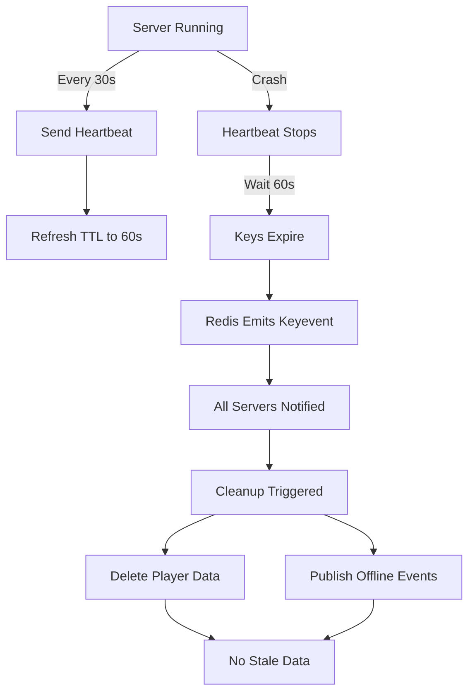

# Redis Network System - Quick Reference

## Architecture

```
┌──────────────┐  ┌──────────────┐  ┌──────────────┐
│  Server 1    │  │  Server 2    │  │  Server 3    │
└──────┬───────┘  └──────┬───────┘  └──────┬───────┘
       │                 │                 │
       └─────────────────┼─────────────────┘
                         │
                    ┌────▼─────┐
                    │  Redis   │
                    │          │
                    │ Keyspace │
                    │ Events   │
                    └──────────┘
```

## Key Redis Patterns

### 1. Server Info (String with TTL)
```
Key:   nexus:server:info:{serverId}
Type:  String
TTL:   60 seconds (refreshed by heartbeat)
Value: JSON ServerInfo object
```

### 2. Server Players (Set with TTL)
```
Key:   nexus:server:players:{serverId}
Type:  Set of UUIDs
TTL:   60 seconds (refreshed by heartbeat)
Value: Player UUID strings
```

### 3. Player Info (String with TTL)
```
Key:   nexus:player:info:{uuid}
Type:  String
TTL:   60 seconds (refreshed by heartbeat)
Value: JSON PlayerInfo object
```

### 4. Global Online Players (Set, no TTL)
```
Key:   nexus:players:online
Type:  Set of UUIDs
TTL:   None (cleaned via keyspace notifications)
Value: All online player UUIDs
```

## TTL Strategy

| Scenario | What Happens |
|----------|--------------|
| **Normal Operation** | Heartbeat every 30s refreshes TTL to 60s |
| **Graceful Shutdown** | Server explicitly deletes keys |
| **Server Crash** | Keys expire after 60s, keyspace notification triggers cleanup |
| **Network Partition** | Same as crash - keys expire, cleanup triggered |

## Crash Detection Flow



## API Reference

### ServerRegistry

```kotlin
// Get server info
suspend fun getServer(serverId: String): ServerInfo?

// Get all online servers
suspend fun getOnlineServers(): Collection<ServerInfo>

// Register server (called on startup)
suspend fun registerServer(server: ServerInfo)

// Unregister server (called on shutdown)
suspend fun unregisterServer(serverId: String)

// Update heartbeat (called every 30s)
suspend fun updateHeartbeat(serverId: String, playerCount: Int, ttl: Long)
```

### PlayerRegistry

```kotlin
// Get player info
suspend fun getPlayer(playerId: UUID): PlayerInfo?

// Get all online players globally
suspend fun getOnlinePlayers(): Collection<PlayerInfo>

// Get players on specific server
suspend fun getPlayersByServer(serverId: String): Collection<PlayerInfo>

// Get player count on server (more efficient)
suspend fun getPlayerCountOnServer(serverId: String): Long

// Update player location (join/quit/transfer)
suspend fun updatePlayerLocation(
    playerId: UUID, 
    username: String, 
    serverId: String?,  // null = offline
    ttl: Long = 60
)

// Clean up server players (called on crash detection)
suspend fun cleanupServerPlayers(serverId: String)
```

### RedisConfig

```kotlin
// Enable keyspace notifications (automatic on startup)
suspend fun enableKeyspaceNotifications(redis: RedisController)

// Validate Redis configuration
suspend fun validateConfiguration(redis: RedisController)
```

## Event Streams

All registries provide Flow-based event streams:

```kotlin
// Server events
val serverOnlineEvents: Flow<ServerOnlineEvent>
val serverOfflineEvents: Flow<ServerOfflineEvent>

// Player events
val playerOnlineEvents: Flow<PlayerOnlineEvent>
val playerOfflineEvents: Flow<PlayerOfflineEvent>
val playerChangeServerEvents: Flow<PlayerChangeServerEvent>
```

### Usage Example

```kotlin
// Listen for servers going offline
scope.launch {
    serverRegistry.serverOfflineEvents.collect { event ->
        println("Server ${event.serverId} went offline")
        
        // Cleanup players from that server
        playerRegistry.cleanupServerPlayers(event.serverId)
    }
}
```

## Redis Commands Cheat Sheet

### Check Server Status
```bash
# Get server info
redis-cli GET nexus:server:info:survival-1

# Check TTL
redis-cli TTL nexus:server:info:survival-1

# Get all servers
redis-cli KEYS nexus:server:info:*
```

### Check Players
```bash
# Get player info
redis-cli GET nexus:player:info:550e8400-e29b-41d4-a716-446655440000

# Get players on server
redis-cli SMEMBERS nexus:server:players:survival-1

# Get all online players
redis-cli SMEMBERS nexus:players:online

# Count players on server
redis-cli SCARD nexus:server:players:survival-1
```

### Monitor Events
```bash
# Monitor all pub/sub messages
redis-cli PSUBSCRIBE '*'

# Monitor keyspace notifications
redis-cli PSUBSCRIBE '__keyevent@0__:expired'

# Monitor server events
redis-cli SUBSCRIBE server:online server:offline
```

### Configuration
```bash
# Check keyspace notifications
redis-cli CONFIG GET notify-keyspace-events

# Enable keyspace notifications
redis-cli CONFIG SET notify-keyspace-events Ex

# Check Redis version
redis-cli INFO server | grep redis_version
```

## Common Issues & Solutions

### Issue: "Stale players showing online"
**Check:**
```bash
redis-cli GET nexus:player:info:{uuid}
redis-cli TTL nexus:player:info:{uuid}
```
**Solution:** Verify heartbeat is running and TTL is being refreshed.

### Issue: "Server shows offline but is running"
**Check:**
```bash
redis-cli GET nexus:server:info:server-1
redis-cli TTL nexus:server:info:server-1
```
**Solution:** Check server logs for heartbeat errors, verify Redis connection.

### Issue: "Crash detection not working"
**Check:**
```bash
redis-cli CONFIG GET notify-keyspace-events
```
**Solution:** Must return "Ex" or "AEx". Run:
```bash
redis-cli CONFIG SET notify-keyspace-events Ex
```

### Issue: "Players not cleaned up after crash"
**Check Server Logs:** Look for "Server went offline" message and cleanup calls.

**Manual Cleanup:**
```bash
# Delete server players
redis-cli DEL nexus:server:players:crashed-server

# Find stale players
redis-cli SMEMBERS nexus:server:players:crashed-server

# Remove from online set
redis-cli SREM nexus:players:online {uuid}
```

## Configuration

### application.yml (or equivalent)

```yaml
features:
  servers:
    serverId: "survival-1"              # Unique server ID
    serverName: "Survival Server"       # Display name
    serverType: "SURVIVAL"              # SURVIVAL, CREATIVE, LOBBY, etc.
    host: "play.example.com"            # Server hostname
    port: 25566                         # Server port
    maxPlayers: 100                     # Max players
    heartbeatIntervalSeconds: 30        # How often to send heartbeat
    heartbeatTimeoutSeconds: 60         # TTL for all data
```

### Tuning TTL Values

**Aggressive (faster crash detection):**
- heartbeatIntervalSeconds: 15
- heartbeatTimeoutSeconds: 30
- Result: 15-30s crash detection, more Redis operations

**Conservative (less Redis load):**
- heartbeatIntervalSeconds: 60
- heartbeatTimeoutSeconds: 120
- Result: 60-120s crash detection, fewer Redis operations

**Recommended (balanced):**
- heartbeatIntervalSeconds: 30
- heartbeatTimeoutSeconds: 60
- Result: 30-60s crash detection, moderate Redis load

## Testing

### Test Server Crash
```bash
# Start server
./gradlew :plugin:runServer

# In another terminal, kill process
ps aux | grep nexus
kill -9 <pid>

# Check Redis after 60s
redis-cli GET nexus:server:info:server-1  # Should be gone

# Check logs on other servers
# Should see: "Server 'server-1' went offline"
```

### Test Network Partition
```bash
# Block Redis connection using firewall/iptables
# Or stop Redis: redis-cli SHUTDOWN

# Wait 60s

# Restart Redis
# Verify server re-registers on next heartbeat
```

## Performance

### Current Implementation
- **Small networks (<10 servers):** Excellent
- **Medium networks (10-100 servers):** Good
- **Large networks (>100 servers):** Consider SCAN optimization

### Memory Usage
- ~1KB per server
- ~500 bytes per player
- Example: 10 servers, 1000 players = ~500KB

### Network Usage
- Heartbeat: ~1KB per 30 seconds per server
- Player join/quit: ~1KB per event
- Example: 10 servers = ~2KB/min baseline

## Summary

### ✅ What Works Now
- Automatic crash detection
- No stale data (maximum 60s)
- Self-healing on crashes
- Redis best practices followed
- Comprehensive monitoring

### 🎯 Best Practices
1. Always set TTL on temporary data
2. Refresh TTL on updates
3. Use keyspace notifications for cleanup
4. Monitor Redis configuration
5. Test crash scenarios regularly

### 📚 Documentation
- `REDIS_IMPLEMENTATION.md` - Full technical details
- `CHANGES_SUMMARY.md` - What changed and why
- This file - Quick reference

### 🚀 Next Steps
1. Test server crash scenarios
2. Monitor in production
3. Tune TTL values for your needs
4. Add metrics/monitoring
5. Consider SCAN for large scale

